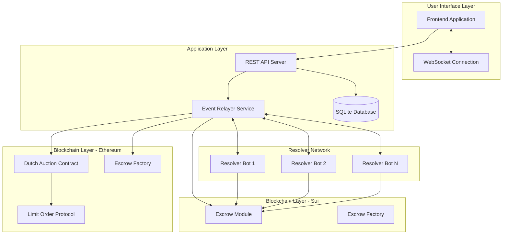
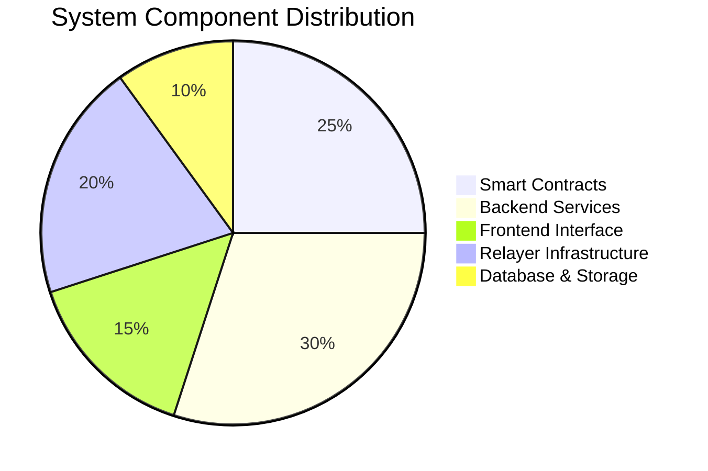
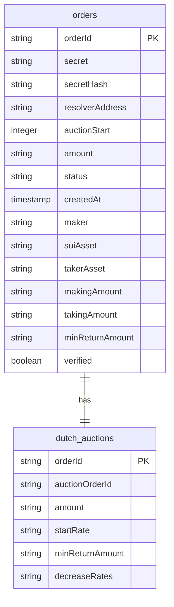
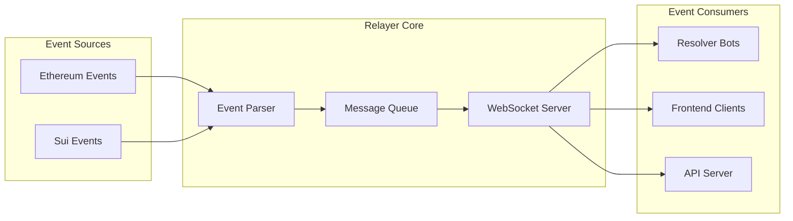
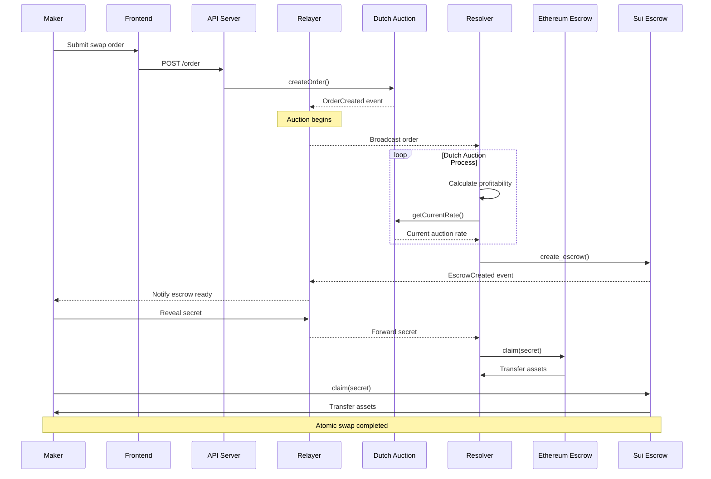
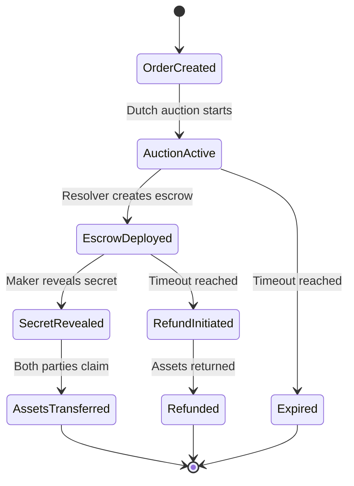

# SuiFusion: Cross-Chain Atomic Swaps via Dutch Auction Protocol

<div align="center">
  
</div>

<div align="center">

[](https://expressjs.com)
[](https://sui.io)
[](https://ethereum.org)
[](https://metamask.io)
[](https://typescriptlang.org)
[](https://sqlite.org)
</div>

**A novel extension for 1inch Fusion+ enabling trustless, atomic cross-chain swaps between Ethereum (Base Sepolia) and Sui through Dutch Auction mechanisms and custom escrow protocols.**

---

## Table of Contents

- [Overview](#overview)
- [Core Architecture](#core-architecture)
- [System Components](#system-components)
- [Protocol Flow](#protocol-flow)
- [Smart Contract Implementation](#smart-contract-implementation)
- [Dutch Auction Mechanism](#dutch-auction-mechanism)
- [Security Model](#security-model)
- [Technical Implementation](#technical-implementation)
- [Deployment Guide](#deployment-guide)
- [API Reference](#api-reference)
- [Contributing](#contributing)

---

## Overview

SuiFusion introduces a groundbreaking approach to cross-chain asset swaps by combining Hash Time Locked Contracts (HTLCs) with competitive Dutch auction pricing. Unlike traditional bridge-based solutions, SuiFusion ensures true atomicity and eliminates counterparty risk through on-chain escrow mechanisms deployed on both source and destination chains.

### Key Innovation Points

- **Trustless Atomic Swaps**: No intermediate custody or centralized authority required
- **Dutch Auction Price Discovery**: Real-time competitive pricing through resolver participation
- **Multi-Chain HTLC Implementation**: Custom escrow contracts on both EVM and Move ecosystems
- **Event-Driven Architecture**: Sophisticated off-chain coordination with on-chain settlement
- **1inch Fusion+ Integration**: Built as a natural extension to existing 1inch infrastructure

### Supported Networks

| Network | Type | Contract Language | Status |
|---------|------|-------------------|---------|
| Base Sepolia | EVM | Solidity | Live |
| Sui Devnet | Move | Move | Live |

---

## Core Architecture



### System Component Distribution



---

## System Components

### 1. Frontend Application (`frontend/`)

**Technology Stack**: React, TypeScript, Web3 Integration
**Purpose**: User interface for order creation, tracking, and management

**Key Features**:
- Order submission interface with real-time validation
- Dutch auction progress visualization
- Transaction status tracking
- Multi-wallet support (MetaMask, Sui Wallet)

### 2. Backend Server (`another-server/`)

**Technology Stack**: Node.js, Express, TypeScript, SQLite
**Purpose**: Order management, API endpoints, and business logic coordination

**Database Schema**:



### 3. Event Relayer

**Technology Stack**: Node.js, TypeScript, WebSocket, Blockchain SDKs
**Purpose**: Cross-chain event monitoring and coordination

**Service Architecture**:



### 4. Smart Contracts

#### Ethereum Contracts (`contracts/`)

**FusionDutchAuction.sol**: Core auction mechanism with discrete rate steps
**EscrowSrc.sol**: HTLC implementation for source chain asset locking
**EscrowFactory.sol**: Factory pattern for escrow deployment

#### Sui Contracts (`suicontracts/escrow/`)

**escrow.move**: Move-based HTLC implementation
**escrow_factory.move**: Factory module for escrow instantiation

---

## Protocol Flow

### Complete Order Lifecycle



### State Machine Diagram



---

## Smart Contract Implementation

### Dutch Auction Contract

The FusionDutchAuction contract implements a sophisticated pricing mechanism with discrete rate steps:

```solidity
struct Order {
    address user;
    address srcToken;
    uint256 amount;
    uint256 auctionStart;
    uint256 startrate;
    uint256 minReturnAmount;
    uint256[] decrease_rates;
    bool filled;
}

function getCurrentRate(bytes32 orderId) public view returns (uint256) {
    Order storage order = orders[orderId];
    require(order.user != address(0), "Order not found");

    if (block.timestamp < order.auctionStart) {
        return order.startrate;
    }

    uint256 elapsed = block.timestamp - order.auctionStart;
    uint256 totalDecrease;
    uint256 stepsToCalculate = elapsed > order.decrease_rates.length 
        ? order.decrease_rates.length 
        : elapsed;
    
    for (uint256 i = 0; i < stepsToCalculate; i++) {
        totalDecrease += order.decrease_rates[i];
    }

    uint256 currentRate = order.startrate > totalDecrease 
        ? order.startrate - totalDecrease 
        : 0;
    
    return currentRate > order.minReturnAmount 
        ? currentRate 
        : order.minReturnAmount;
}
```

### HTLC Implementation

#### Ethereum Escrow

```solidity
contract EscrowSrc {
    address public maker;
    IERC20 public asset;
    uint256 public amount;
    bytes32 public hashlock;
    uint256 public timelock;
    bool public claimed;
    bool public refunded;

    function claim(bytes32 secret) external {
        require(!claimed && !refunded, "Already handled");
        require(keccak256(abi.encodePacked(secret)) == hashlock, "Invalid secret");
        require(block.timestamp < timelock, "Timelock expired");
        
        claimed = true;
        require(asset.transfer(msg.sender, amount), "Transfer failed");
    }

    function refund() external {
        require(!claimed && !refunded, "Already handled");
        require(block.timestamp >= timelock, "Timelock not expired");
        require(msg.sender == maker, "Only maker can refund");
        
        refunded = true;
        require(asset.transfer(maker, amount), "Transfer failed");
    }
}
```

#### Sui Escrow (Move)

```move
module escrow::escrow {
    use sui::event;
    use sui::object::{new, uid_to_inner, delete};
    use sui::transfer::public_transfer;
    use sui::coin::{Coin, value, into_balance, from_balance};
    use sui::balance::Balance;

    public struct Escrow<phantom T> has key, store {
        id: UID,
        maker: address,
        asset: Balance<T>,
        hashlock: vector<u8>,
        timelock: u64,
        claimed: bool,
        refunded: bool,
    }

    public fun create_escrow<T>(
        maker: address,
        asset: Coin<T>,
        hashlock: vector<u8>,
        timelock: u64,
        ctx: &mut TxContext
    ): Escrow<T> {
        let id = new(ctx);
        let amount = value(&asset);
        let asset_balance = into_balance(asset);
        let escrow = Escrow {
            id,
            maker,
            asset: asset_balance,
            hashlock,
            timelock,
            claimed: false,
            refunded: false,
        };
        
        let escrow_id = uid_to_inner(&escrow.id);
        event::emit(EscrowCreated {
            escrow_id,
            maker,
            amount,
            hashlock,
            timelock,
        });
        
        escrow
    }

    public fun claim<T>(
        escrow: Escrow<T>,
        secret: vector<u8>,
        c...